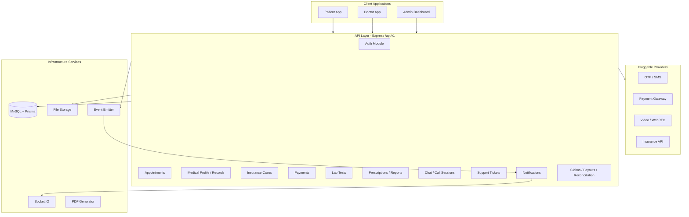
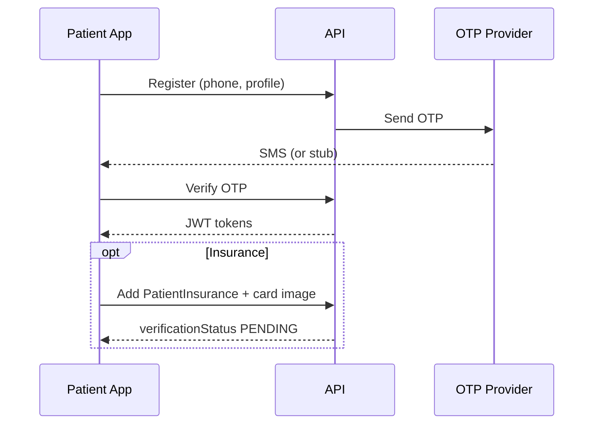
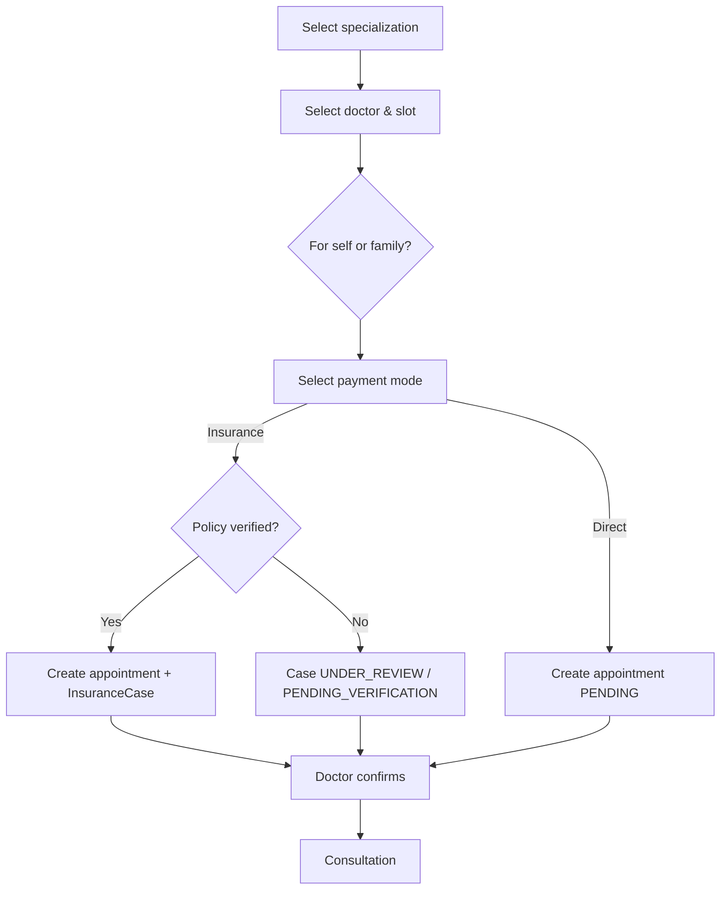
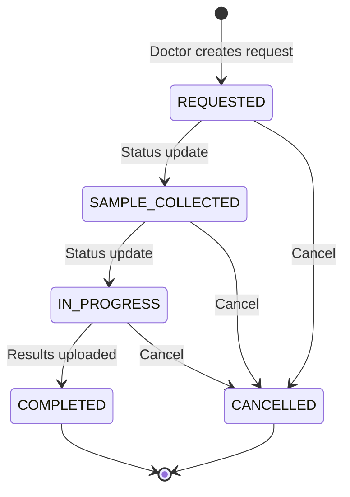

# Product Requirements Document (PRD)

## CareGate Healthcare Ecosystem Platform

| Field | Value |
|-------|-------|
| **Product name (spec)** | CareGate |
| **Product name (implementation)** | Haya Bila Alam — حياة بلا ألم |
| **Repository** | Life-WithoutPain |
| **Document version** | 1.0 |
| **Last updated** | June 3, 2026 |
| **Status** | Living document — aligned with backend API, admin dashboard, and Figma/mobile specs |

---

## Table of Contents

1. [Executive Summary](#1-executive-summary)
2. [Product Vision & Positioning](#2-product-vision--positioning)
3. [Stakeholders & User Roles](#3-stakeholders--user-roles)
4. [System Architecture Overview](#4-system-architecture-overview)
5. [System Modules](#5-system-modules)
6. [End-to-End Workflows](#6-end-to-end-workflows)
7. [Lab Tests & Medical Tests (Detailed)](#7-lab-tests--medical-tests-detailed)
8. [Functional Requirements](#8-functional-requirements)
9. [Non-Functional Requirements](#9-non-functional-requirements)
10. [Business Rules & Hidden System Logic](#10-business-rules--hidden-system-logic)
11. [Data Model Summary](#11-data-model-summary)
12. [Applications & Delivery Surfaces](#12-applications--delivery-surfaces)
13. [Integrations & External Systems](#13-integrations--external-systems)
14. [Implementation Status](#14-implementation-status)
15. [Future Roadmap](#15-future-roadmap)
16. [Glossary](#16-glossary)
17. [Appendices](#17-appendices)

---

## 1. Executive Summary

CareGate (implemented as **Haya Bila Alam**) is not a simple telemedicine or doctor-booking application. It is a **multi-stakeholder digital healthcare operating system** that connects patients, doctors, insurance companies, administrative staff, customer support, accounting teams, and (in future phases) hospitals, laboratories, and government health systems.

The platform supports:

- **Telemedicine** (video, voice, chat consultations)
- **Electronic Medical Records (EMR)** with longitudinal patient history
- **Insurance workflows** (policy registration, pre-authorization, claims, reconciliation)
- **Payments** (direct and insurance-based)
- **Medical documentation** (prescriptions, reports, lab requests/results)
- **Home healthcare services**
- **Real-time communication** (chat, support tickets, notifications)
- **Financial operations** (claims batches, doctor payouts, reconciliation)

**Current delivery state:** A production-shaped **backend API** and **admin dashboard** are implemented. **Patient** and **doctor** mobile applications are specified via OpenAPI/Swagger and integration guides; their UI codebases are external to this repository.

---

## 2. Product Vision & Positioning

### 2.1 What the product is

| The product is | The product is not |
|----------------|-------------------|
| A full digital healthcare OS | A “doctor booking app” only |
| An EMR + insurance + payments ecosystem | A standalone video-call tool |
| A workflow-driven, multi-role platform | A CRUD-only admin panel |
| Bilingual (Arabic-first) healthcare SaaS | English-only MVP |

### 2.2 Strategic pillars

1. **Clinical continuity** — Longitudinal records, prescriptions, reports, and lab results tied to appointments and patients.
2. **Payer integration** — Insurance verification, pre-auth, claims, and finance reconciliation as first-class workflows.
3. **Access & convenience** — Telemedicine, home visits, family booking, and support channels.
4. **Operational control** — RBAC admin dashboard for medical, insurance, support, and finance teams.
5. **Extensibility** — Provider abstractions for OTP, payments, video, insurance APIs, and storage (mock → production).

### 2.3 Target markets & localization

- Primary UX: **Arabic (RTL)** with **English (LTR)** support.
- Bilingual content in database fields (`nameAr`/`nameEn`, notification titles, support copy).
- Mobile-first patient/doctor experience; web admin dashboard for operations.

---

## 3. Stakeholders & User Roles

### 3.1 Role matrix

| Role | Application | Primary responsibilities |
|------|-------------|-------------------------|
| **Patient** | Patient mobile app | Register, book appointments, manage family & insurance, access EMR, chat, pay, attend teleconsultations, upload lab results, open support tickets |
| **Doctor** | Doctor mobile app | Register (pending approval), manage availability, conduct consultations, prescribe, report, request labs, review results, chat, call sessions |
| **Super Admin** | Admin dashboard | Full system control, RBAC, users, settings, all modules |
| **Medical Admin** | Admin dashboard | Doctors, patients, appointments, clinical records, services, specialities, master medical data |
| **Insurance Staff** | Admin dashboard | Insurance cases, policy verification support, escalations |
| **Support Staff** | Admin dashboard | Support tickets, user issues, insurance/payment/appointment escalations |
| **Accountant** | Admin dashboard | Payments, claims, reconciliations, doctor payouts |
| **External systems** (future) | APIs | Hospitals (HIS), labs (LIS), government, insurer APIs |

### 3.2 Patient — detailed capabilities

| Area | Requirements |
|------|----------------|
| Identity | Register with phone/email, OTP verification, login/logout, password reset, account deletion |
| Profile | Personal details, preferred language, avatar |
| Medical profile | Chronic diseases, allergies, medications (catalog-linked), attachments, medical timeline |
| Family | Add/edit/delete family members; book appointments on behalf of dependents |
| Insurance | Add policies (provider, member ID, card image), track verification status, select policy at booking |
| Discovery | Browse specializations, sub-specializations, search doctors, view profiles & availability |
| Booking | Book for self or family; choose service type (remote/home/clinic); direct or insurance payment |
| Consultation | Join video/voice session, appointment chat, view session info |
| Records | Prescriptions (PDF/QR), medical reports (PDF), medical files, x-rays/radiology uploads |
| Lab tests | View doctor requests, track status, upload result files, download/view PDF |
| Payments | Initiate payment for appointment or home service; view payment history |
| Home services | Request home visit, address, preferred date, insurance/direct payment |
| Support | View contact info (WhatsApp, phone, hours), create/reply to tickets with attachments |
| Notifications | In-app list; real-time via Socket.IO |

### 3.3 Doctor — detailed capabilities

| Area | Requirements |
|------|----------------|
| Onboarding | Register with license upload, OTP, await admin verification (approve/reject) |
| Profile | Bio (AR/EN), speciality, sub-specialities, fees, clinic details, certificates |
| Availability | Weekly schedule by day/period; public bookable flag |
| Appointments | List/filter, confirm/reject, cancel, start session, complete |
| Clinical | Create prescriptions (items: medicine, dosage, frequency, duration), medical reports, lab test requests |
| Lab tests | Create request per appointment, update status, upload/review results |
| Communication | Appointment chat, call sessions (create/start/end) |
| Patients | View assigned patients and context for active care |
| Support | Same ticket flow as patient (creator role = DOCTOR) |
| Notifications | Verification, appointments, chat, support |

### 3.4 Admin staff — permission model (RBAC)

Permissions are stored in DB (`Permission`, `RolePermission`, `UserPermission`) with a canonical catalog. Examples:

| Permission domain | Example keys | Typical roles |
|-------------------|--------------|---------------|
| Users | `users.list`, `users.create` | Super Admin, Medical Admin |
| Patients | `patients.list`, `patients.insurance.verify` | Medical Admin, Insurance Staff, Support |
| Doctors | `doctors.verify` | Super Admin, Medical Admin |
| Appointments | `appointments.list`, `appointments.update` | Super Admin, Medical Admin |
| Insurance | `insurance.cases.decide`, `insurance.providers.manage` | Insurance Staff, Super Admin |
| Support | `support.tickets.manage` | Support Staff |
| Finance | `claims.manage`, `payouts.manage`, `payments.list` | Accountant |
| Clinical admin | `prescriptions.admin.list`, `lab-tests.list`, `medical-master.manage` | Medical Admin |
| Audit | `audit.view` | Super Admin (Medical Admin may be restricted in demo) |

**Mobile apps** use role-based JWT (`PATIENT` / `DOCTOR`) without granular permission keys. **Dashboard** enforces permission keys per route.

---

## 4. System Architecture Overview

### 4.1 Logical architecture

### 4.2 Architectural principles

| Principle | Requirement |
|-----------|-------------|
| **Domain-driven modules** | Feature folders: appointments, insurance-cases, lab-tests, etc. — not monolithic CRUD only |
| **Workflow-based state machines** | Appointment status transitions, lab test statuses, insurance case lifecycle |
| **Event-driven notifications** | Domain events → listeners → `Notification` + Socket.IO |
| **Strict RBAC** | Staff actions gated by permission catalog |
| **Medical-grade modeling** | Separate catalogs vs. clinical instances (e.g. `MedicalTest` vs. `LabTestRequest`) |
| **Provider abstraction** | Mock implementations default; swap via environment config |
| **API versioning** | Base path `/api/v1` |

### 4.3 Technology stack (as implemented)

| Layer | Technology |
|-------|------------|
| Backend runtime | Node.js, Express.js |
| Database | MySQL, Prisma ORM |
| Validation | Zod |
| Auth | JWT (access + refresh), OTP |
| Real-time | Socket.IO (notifications, support tickets) |
| API docs | Swagger / OpenAPI |
| Admin UI | React 19, Vite, Tailwind, react-i18next (AR default) |
| Logging | Pino |

---

## 5. System Modules

### 5.1 Module catalog

| # | Module | Purpose | Primary actors |
|---|--------|---------|----------------|
| 1 | **Authentication & Identity** | Registration, login, OTP, tokens, RBAC | All |
| 2 | **Medical Profile (EMR Core)** | Chronic conditions, allergies, meds, attachments, timeline | Patient, Doctor, Admin |
| 3 | **Doctor Discovery** | Specialities, doctor search, profiles, certificates, availability | Patient |
| 4 | **Appointment System** | Booking, scheduling, status lifecycle, fees, family booking | Patient, Doctor, Admin |
| 5 | **Telemedicine** | Video/voice sessions, session URLs, appointment-linked calls | Patient, Doctor |
| 6 | **Insurance** | Policies, verification, cases, pre-auth, approvals, escalations | Patient, Insurance Staff, Admin |
| 7 | **Payments** | Direct/insurance billing, webhooks, tracking | Patient, Accountant |
| 8 | **Medical Documentation** | Prescriptions (PDF/QR), reports (PDF), attachments | Doctor, Patient, Admin |
| 9 | **Lab Tests & Medical Tests** | Catalog, requests, status, results upload, review | Doctor, Patient, Admin |
| 10 | **Chat & Communication** | Appointment conversations, read receipts | Patient, Doctor |
| 11 | **Family Management** | Dependents, proxy booking | Patient |
| 12 | **Home Services** | Admin-defined services, visit requests, doctor assignment | Patient, Admin, Doctor |
| 13 | **Support System** | Tickets, categories, real-time thread, contact info | Patient, Doctor, Support Staff |
| 14 | **Notifications** | Event-driven, bilingual, permission-filtered staff inbox | All |
| 15 | **Admin Dashboard** | CRUD, detail pages, RBAC, master data, audit | Staff roles |
| 16 | **Finance** | Claims batches, claim items, reconciliations, doctor payouts | Accountant |
| 17 | **Reviews & Ratings** | Post-appointment reviews, moderation | Patient, Admin |

---

### 5.2 Module specifications

#### 5.2.1 Authentication & Identity

**Features**

- Patient registration (`POST /patient/auth/register`)
- Doctor registration with license document upload
- OTP send/verify/resend (stub in dev: configurable mock code)
- Login: staff email, patient phone, doctor mobile
- Refresh tokens, logout, password forgot/reset/change
- `GET /auth/me` — current user + effective permissions (staff)

**Entities:** `User`, `PatientProfile`, `DoctorProfile`, `OtpCode`, `RefreshToken`, `Role`, `Permission`

**Acceptance criteria**

- Unverified doctor cannot be publicly bookable until `verificationStatus = APPROVED`
- Patient JWT only accesses patient-scoped routes
- Socket connections require valid JWT in handshake

---

#### 5.2.2 Medical Profile Module (EMR Core)

**Features**

- Patient medical profile CRUD
- Link to master catalogs: `ChronicDisease`, `Medication`, `Allergy`
- Profile attachments (reports, documents)
- Medical timeline (aggregated clinical events)
- Patient medical files by category: `LAB_RESULT`, `RADIOLOGY`, `PRESCRIPTION`, `MEDICAL_REPORT`, `INSURANCE_DOCUMENT`, `ID_DOCUMENT`, `OTHER`
- Doctor read access for patients under care

**Figma field aliases (API):** `chronicDiseases` → `chronicDiseaseIds`, `mainMedications` → `medicationIds`; reports via attachments endpoint.

**Acceptance criteria**

- Catalog IDs must reference active master records
- Attachments stored via secure upload pipeline with MIME validation

---

#### 5.2.3 Doctor Discovery Module

**Features**

- List specializations and sub-specializations (bilingual)
- Search/filter doctors by speciality, city, availability
- Doctor profile: bio, experience, fees, ratings, verification status
- View doctor availability slots (day of week, period: MORNING/AFTERNOON/EVENING)
- Only `isPubliclyBookable = true` and approved doctors appear in patient search

---

#### 5.2.4 Appointment System (Core Engine)

**Appointment types:** `CONSULTATION`, `FOLLOW_UP`, `EMERGENCY`

**Service types (catalog):** `REMOTE` (telemedicine), `HOME`, `CLINIC`

**Status lifecycle:**

| Status | Meaning | Allowed next states |
|--------|---------|---------------------|
| `PENDING` | Awaiting doctor confirmation | `CONFIRMED`, `CANCELLED` |
| `CONFIRMED` | Scheduled | `IN_PROGRESS`, `CANCELLED`, `RESCHEDULED`, `NO_SHOW` |
| `IN_PROGRESS` | Session active | `COMPLETED` |
| `COMPLETED` | Closed successfully | — |
| `CANCELLED` | Cancelled | — |
| `RESCHEDULED` | Date/time changed | `PENDING`, `CONFIRMED`, `CANCELLED` |
| `NO_SHOW` | Patient did not attend | — |

**Booking features**

- Select doctor, date, time slot (`startTime`/`endTime`)
- Book for **self** or **family member** (`familyMemberId`)
- Payment mode: **insurance** or **direct** (`bookingMethod`)
- Fees from doctor service catalog
- Attachments on appointment
- Insurance status on appointment: `NOT_REQUIRED`, `PENDING_VERIFICATION`, `APPROVED`, `REJECTED`, `PARTIALLY_APPROVED`

**Patient views:** upcoming, past, cancel, reschedule, session info

**Acceptance criteria**

- Insurance booking requires at least one policy on file; uses primary verified policy if none selected
- Creating appointment with insurance triggers insurance orchestrator (pre-authorization case)
- Status transitions enforced server-side (invalid transitions rejected)

---

#### 5.2.5 Telemedicine Module

**Features**

- `CallSession` per appointment: types `VIDEO`, `VOICE`
- Doctor creates/starts session; patient retrieves join info
- Provider field (default `mock`) — pluggable video provider

**Acceptance criteria**

- Session only available for confirmed/in-progress remote appointments
- Session end updates timestamps and frees resources

---

#### 5.2.6 Insurance Module

**Patient insurance (`PatientInsurance`)**

- Link to `InsuranceProvider`
- Fields: member ID, policy number, expiry, card image, `isPrimary`, `verificationStatus` (PENDING/VERIFIED/REJECTED/EXPIRED)

**Insurance cases (`InsuranceCase`)**

- Types: `PRE_AUTHORIZATION`, `CLAIM`, `INQUIRY`
- Request types: `CONSULTATION`, `PROCEDURE`, `LAB_TEST`, `MEDICATION`
- Statuses: `OPEN`, `UNDER_REVIEW`, `APPROVED`, `REJECTED`, `MORE_INFO_REQUESTED`, `ESCALATED`, `CLOSED`
- Linked to appointment and/or home service request
- Approvals with requested/approved amounts and decider audit

**Provider integration modes:** `MANUAL`, `API`, `HYBRID`

**Workflow triggers**

- Auto-created on insurance-mode appointment booking
- Status sync back to appointment `insuranceStatus`
- Events: `insurance.case_created`, `insurance.case_updated` → notifications

**Staff actions:** decide, escalate, add notes, link to support case

---

#### 5.2.7 Payment Module

**Features**

- Payment records linked to appointment or home service
- Patient initiate payment
- Webhook endpoint for gateway callbacks
- Status tracking (pending, paid, failed — per `PaymentStatus` enum)
- Mock provider: auto-PAID in development

**Payment methods (product target):** Visa, Mastercard, Apple Pay (gateway TBD)

**Gaps (required, not fully implemented):** refunds, formal receipts

---

#### 5.2.8 Medical Documentation Module

**Prescriptions**

- Diagnosis, notes, line items (medicine, dosage, frequency, duration, instructions)
- PDF generation + QR code value
- Patient download; admin list/detail

**Medical reports**

- Visit reason, diagnosis, summary, symptoms, clinical findings, vitals (JSON), exam (JSON), results, recommendations
- Optional link to prescription
- Attachments, PDF export

**Future:** digital signatures, DICOM for imaging

---

#### 5.2.9 Chat & Communication Module

**Features**

- `Conversation` per appointment (typical)
- Messages with sender, timestamps, read receipts
- Event `chat.message_sent` → notification to other party
- Support chat separate (see Support module) with Socket.IO rooms

---

#### 5.2.10 Family Management Module

**Features**

- CRUD family members on patient profile
- Fields: name, relationship, date of birth, gender, etc.
- Book appointments with `familyMemberId`
- Medical context uses patient account owner with family member attribution on appointment

---

#### 5.2.11 Home Services Module

**Features**

- Admin manages `Service` catalog (type `HOME`)
- Patient creates `HomeServiceRequest`: address, preferred date, notes
- No doctor at booking; admin/system assigns `assignedDoctorId` later
- May spawn linked `Appointment`
- Parallel insurance and payment flows to appointments

**Statuses:** `PENDING`, `ASSIGNED`, `SCHEDULED`, `COMPLETED`, `CANCELLED`

---

#### 5.2.12 Support System

**Contact info (singleton):** phones, email, WhatsApp link, social links, working hours (AR/EN), localized description

**Tickets (`SupportCase`)**

| Field | Values |
|-------|--------|
| Category | `TECHNICAL`, `APPOINTMENT`, `PAYMENT`, `INSURANCE`, `ACCOUNT`, `OTHER` |
| Priority | `LOW`, `MEDIUM`, `HIGH`, `URGENT` |
| Status | `OPEN`, `IN_PROGRESS`, `RESOLVED`, `CLOSED` |

- Create with up to 5 file attachments
- Thread messages; staff assignee
- Link to appointment, insurance case
- Real-time: `support:join`, `support:message`, `support:status` over Socket.IO

---

#### 5.2.13 Notification System

| Type | Trigger examples | Staff needs permission |
|------|------------------|------------------------|
| `USER` | Registration | `users.list` |
| `APPOINTMENT` | Create, status change | `appointments.list` |
| `INSURANCE` | Case create/update | `insurance.cases.list` |
| `SUPPORT` | Ticket/message/status | `support.tickets.list` |
| `PAYMENT` | Paid/failed | `payments.list` |
| `VERIFICATION` | Doctor signup/approve/reject | `doctors.list` |
| `LAB_RESULT` | Result uploaded | `medical-master.list` |
| `PRESCRIPTION` | Issued | `prescriptions.admin.list` |
| `REPORT` | Created | `reports.admin.list` |
| `REVIEW` | New review | `reviews.moderate` |
| `CHAT` | New message | `dashboard.view` |
| `SYSTEM` | Admin broadcast | `dashboard.view` |

Delivery: persist `Notification` (bilingual) + emit `notification:new` on Socket.IO room `notifications:user:{userId}`.

**Admin dashboard:** The topbar bell lists the signed-in staff member's permission-filtered inbox (`GET /notifications`). The sidebar Notifications page lists only manual admin campaigns (`source = ADMIN_MANUAL`), with send-to audience (patients, doctors, staff, role, or specific user), resend, and read-only detail modal. Appointment confirm from admin uses `AppointmentService.updateStatus` so CONFIRMED notifications use dedicated bilingual copy.

Status badges in the admin UI use semantic variants (success / warning / danger / info / secondary) via a shared `StatusBadge` component.

---

#### 5.2.14 Admin Dashboard Module

**Implemented pages (representative)**

- Dashboard stats
- Users, Patients (detail with medical profile), Doctors (verification workflow)
- Specialities, Sub-specialities, Services
- Appointments (detail with linked entities)
- Insurance cases, Insurance providers
- Support tickets
- Lab tests (list/update — no create from admin UI)
- Medical master data (chronic diseases, allergies, medications, **medical test catalog**)
- Prescriptions, Reports, Reviews
- Payments, Claims, Reconciliations, Doctor payouts
- Notifications (manual send/manage; inbox in topbar bell)
- Patient/doctor detail URL sections (appointments, prescriptions, reports, lab tests)
- Settings, Audit logs, RBAC (roles/permissions)

**i18n:** Arabic default, English toggle, RTL layout.

---

#### 5.2.15 Finance Module

- **Claim batches** per insurance provider, period, submission type (DAILY/MONTHLY)
- **Claim items** per completed appointment
- **Reconciliation** — expected vs. received amounts, discrepancy handling
- **Doctor payouts** — earnings tracking, mark paid

---

## 6. End-to-End Workflows

### 6.1 Patient onboarding

**Steps**

1. Register with personal details (Figma: `name`, `phoneNumber` → API `fullName`, `phone`)
2. Receive and verify OTP
3. Optional: add insurance policy(ies)
4. Optional: complete medical profile (chronic diseases, allergies, medications)
5. Account active — can book and use services

**Acceptance criteria**

- Cannot book with insurance payment mode without at least one policy on file
- Primary policy preferred when multiple exist

---

### 6.2 Appointment booking (with insurance branch)

**Steps**

1. Patient selects specialization → doctor → date/time
2. Select beneficiary: self or family member
3. Select payment: insurance or direct
4. If insurance: resolve policy (explicit ID or primary verified → primary → first)
5. System creates appointment; if insurance, orchestrator creates `PRE_AUTHORIZATION` case
6. Appointment `insuranceStatus` reflects case progress
7. Doctor confirms or rejects
8. Patient receives notifications at each transition

---

### 6.3 Telemedicine consultation

1. Appointment reaches `CONFIRMED` (remote service)
2. At session time, doctor starts session (`IN_PROGRESS`)
3. Call session created (video/voice) — join URLs from provider
4. Parallel: appointment chat available
5. Doctor documents visit: diagnosis, prescription and/or report
6. Doctor may create lab test requests
7. Doctor completes appointment → `COMPLETED`
8. Patient may submit review

---

### 6.4 Prescription flow

1. Doctor creates prescription linked to appointment + patient
2. Adds diagnosis, medication line items
3. System generates PDF and QR code
4. Event `prescription.created` → patient notification
5. Patient views/downloads from records API
6. Optional: pharmacy validation via QR (future)

---

### 6.5 Medical report flow

1. Doctor creates report (vitals, findings, recommendations)
2. Optional attachments
3. PDF generated
4. Patient notified; accessible in records + admin

---

### 6.6 Insurance decision flow

1. Case created (booking or manual)
2. Insurance staff reviews in dashboard
3. Decision: approve / partial / reject / more info / escalate
4. `InsuranceApproval` updated with amounts and notes
5. Orchestrator maps case status → appointment `insuranceStatus`
6. Patient notified; support ticket optional for disputes

---

### 6.7 Family member flow

1. Patient adds family member profile
2. When booking, selects family member as beneficiary
3. Appointment stores `familyMemberId`; clinical records remain under account owner patient ID with family context on appointment
4. Family-specific medical sharing rules: optional future consent flags

---

### 6.8 Support flow

1. User opens support → views `/support/info` (localized)
2. Creates ticket with category and description (+ files)
3. Support staff assigned; replies via dashboard
4. Real-time updates via Socket.IO
5. Resolved/closed with status notifications

---

### 6.9 Home service flow

1. Patient selects HOME-type service
2. Submits visit address, preferred date, notes, payment mode
3. Request `PENDING` → admin assigns doctor → `ASSIGNED`/`SCHEDULED`
4. Insurance case if required (same orchestrator pattern)
5. Payment initiated/completed
6. May link to appointment record for clinical documentation
7. Completed → available for claims/payouts

---

### 6.10 Finance / claims flow (post-visit)

1. Completed insured appointments eligible for claim items
2. Accountant batches claims by provider/period
3. Submit batch → track `ClaimBatchStatus`
4. Reconciliation records match insurer payments
5. Doctor payouts calculated and marked paid

---

## 7. Lab Tests & Medical Tests (Detailed)

This section consolidates product intent, Figma flows, and implemented backend behavior.

### 7.1 Two-layer model (critical distinction)

| Layer | Entity | Purpose | Managed by |
|-------|--------|---------|------------|
| **Catalog** | `MedicalTest` | Standardized test types (name AR/EN, category, description) | Admin — Medical Master Data |
| **Clinical workflow** | `LabTestRequest` + `LabResult` | Per-appointment test orders and results | Doctor creates; patient uploads; doctor reviews |

**Do not conflate** the catalog browse API (`/patient/medical-catalog` / admin `medical-tests`) with active lab orders (`/patient/lab-tests`, `/doctor/lab-tests`).

### 7.2 Lab test request lifecycle

| Status | Description | Typical actor |
|--------|-------------|---------------|
| `REQUESTED` | Doctor ordered test during/after consultation | Doctor |
| `SAMPLE_COLLECTED` | Sample taken (home lab or clinic) | Doctor / Admin update |
| `IN_PROGRESS` | Lab processing | Doctor / Admin update |
| `COMPLETED` | Results available | System on result upload |
| `CANCELLED` | Order cancelled | Doctor / Admin |

### 7.3 Actors and API responsibilities

| Actor | Actions | API base |
|-------|---------|----------|
| **Doctor** | Create request, list own requests, get detail, update status, upload results, list results | `/api/v1/doctor/lab-tests` |
| **Patient** | List own requests, get detail, upload result files, view/download PDF | `/api/v1/patient/lab-tests` |
| **Admin** | List, read, update, delete requests (no create in UI) | `/api/v1/admin/lab-tests` |
| **Shared/Legacy** | Same operations under `/api/v1/lab-tests` | Staff/automation |

### 7.4 Create lab test request (doctor)

**When:** During or after appointment (consultation, follow-up, or emergency).

**Input**

| Field | Required | Notes |
|-------|----------|-------|
| `appointmentId` | Yes | Must be doctor's appointment |
| `patientId` | Yes | Derived from appointment |
| `title` | Yes | Test name/description (may reference catalog informally) |
| `notes` | No | Clinical instructions for patient/lab |

**Output:** `LabTestRequest` with `status = REQUESTED`, `requestedAt` timestamp.

**Business rules**

- Request tied to exactly one appointment and one patient
- Doctor must be the treating physician on the appointment
- Multiple requests allowed per appointment

### 7.5 Patient upload results

**When:** After sample collection / external lab completion.

**Flow**

1. Patient opens lab test detail in app
2. Uploads result file (PDF/image per upload middleware rules)
3. `POST .../results` with multipart `file`
4. System creates `LabResult` record
5. Request status auto-set to `COMPLETED`
6. Event `lab_result.created` fires
7. Notifications sent to patient (confirmation) and staff with `LAB_RESULT` permission

**Result record fields**

- `fileUrl`, `notes`, `uploadedBy`
- `reviewedByDoctor` (boolean), `reviewedAt` — for doctor review tracking

### 7.6 Doctor review of results

1. Doctor lists lab tests filtered by patient/status
2. Views uploaded results
3. Updates treatment plan (prescription/report) based on findings
4. May mark reviewed (field on `LabResult`) — product enhancement to expose in mobile UI

### 7.7 Admin operations

- Search/list all lab test requests
- View linked patient, doctor, appointment
- Update status manually (operations override)
- Delete (super admin permission)
- **Cannot create** requests from dashboard (`canCreate={false}`) — clinical creation is doctor-only

### 7.8 Insurance integration for lab tests

- Insurance case `requestType` may be `LAB_TEST` when procedure mapping applies
- Pre-authorization may be required before covered lab work (configurable per provider/product)
- Claims include appointment-level amounts; lab-specific line items — future enhancement

### 7.9 Future: laboratory integration (LIS)

| Capability | Phase |
|------------|-------|
| Patient manual upload | **Current (MVP)** |
| Admin/doctor status updates | **Current** |
| HL7/FHIR results inbound | Future |
| Direct lab partner API | Future |
| DICOM imaging | Future |

### 7.10 Lab test acceptance criteria (summary)

| ID | Criterion |
|----|-----------|
| LAB-01 | Doctor can create lab request only for own appointments |
| LAB-02 | Patient can only access own lab tests |
| LAB-03 | Status transitions follow enum values |
| LAB-04 | Uploading result sets request to COMPLETED |
| LAB-05 | `lab_result.created` triggers bilingual notification |
| LAB-06 | Patient can retrieve result file / PDF URL |
| LAB-07 | Admin can list/filter but not create requests from UI |
| LAB-08 | Medical test catalog is independently managed and browsable |
| LAB-09 | Lab requests appear in patient medical timeline/records directory |

---

## 8. Functional Requirements

### 8.1 Core platform (FR-CORE)

| ID | Requirement | Priority | Status |
|----|-------------|----------|--------|
| FR-C01 | User registration and login (patient, doctor, staff) | P0 | Implemented |
| FR-C02 | OTP verification | P0 | Implemented (mock provider) |
| FR-C03 | Role-based access control | P0 | Implemented |
| FR-C04 | Appointment booking and lifecycle | P0 | Implemented |
| FR-C05 | Telemedicine sessions | P0 | Implemented (mock video) |
| FR-C06 | Prescriptions with PDF/QR | P0 | Implemented |
| FR-C07 | Medical reports with PDF | P0 | Implemented |
| FR-C08 | Insurance validation workflow | P0 | Implemented |
| FR-C09 | Payments (direct) | P0 | Implemented (mock gateway) |
| FR-C10 | Chat (appointment) | P0 | Implemented |
| FR-C11 | In-app notifications | P0 | Implemented |
| FR-C12 | File upload/download | P0 | Implemented (local storage) |
| FR-C13 | Family management | P0 | Implemented |
| FR-C14 | Home services booking | P1 | Implemented |
| FR-C15 | Support tickets | P1 | Implemented |
| FR-C16 | Lab test requests & results | P0 | Implemented |
| FR-C17 | Reviews after appointment | P2 | Implemented |
| FR-C18 | Audit logging | P1 | Implemented |
| FR-C19 | Claims and reconciliation | P1 | Implemented |
| FR-C20 | Doctor payouts | P1 | Implemented |

### 8.2 Medical / EMR (FR-MED)

| ID | Requirement | Priority | Status |
|----|-------------|----------|--------|
| FR-M01 | Longitudinal medical profile | P0 | Implemented |
| FR-M02 | Chronic disease tracking | P0 | Implemented |
| FR-M03 | Allergy tracking | P0 | Implemented |
| FR-M04 | Medication tracking | P0 | Implemented |
| FR-M05 | Medical timeline | P1 | Implemented |
| FR-M06 | Lab results storage | P0 | Implemented |
| FR-M07 | Radiology/x-ray file category | P1 | Implemented (upload) |
| FR-M08 | DICOM imaging | P3 | Planned |
| FR-M09 | Medical test master catalog | P0 | Implemented |

### 8.3 Business / operations (FR-BIZ)

| ID | Requirement | Priority | Status |
|----|-------------|----------|--------|
| FR-B01 | Doctor registration approval | P0 | Implemented |
| FR-B02 | Service catalog (remote/home/clinic) | P0 | Implemented |
| FR-B03 | Insurance provider management | P0 | Implemented |
| FR-B04 | Insurance case decisions | P0 | Implemented |
| FR-B05 | Financial claims batches | P1 | Implemented |
| FR-B06 | Translation management (UI) | P1 | Implemented (i18n JSON) |
| FR-B07 | Platform settings | P1 | Implemented |
| FR-B08 | Payment refunds | P2 | **Not implemented** |
| FR-B09 | Formal payment receipts | P2 | **Not implemented** |

### 8.4 Communication (FR-COM)

| ID | Requirement | Priority | Status |
|----|-------------|----------|--------|
| FR-COM01 | Real-time appointment chat | P0 | Implemented (REST; not full chat socket) |
| FR-COM02 | Video/audio calls | P0 | Mock provider |
| FR-COM03 | Push notifications (FCM/APNs) | P1 | **Not implemented** (in-app + socket only) |
| FR-COM04 | Support real-time messaging | P1 | Implemented (Socket.IO) |

### 8.5 Mobile apps (FR-MOB) — out of repo

| ID | Requirement | Priority | Status |
|----|-------------|----------|--------|
| FR-MOB01 | Patient app per Figma + OpenAPI | P0 | API ready |
| FR-MOB02 | Doctor app per Figma + OpenAPI | P0 | API ready |
| FR-MOB03 | Field alias compatibility per swagger | P0 | Documented |

---

## 9. Non-Functional Requirements

### 9.1 Security (NFR-SEC)

| ID | Requirement |
|----|-------------|
| NFR-SEC01 | RBAC on all admin endpoints |
| NFR-SEC02 | JWT access + refresh token rotation |
| NFR-SEC03 | OTP for sensitive registration flows |
| NFR-SEC04 | Patient/doctor data scoped to owner |
| NFR-SEC05 | Secure file upload (MIME allowlist, UUID filenames) |
| NFR-SEC06 | Audit log for sensitive admin actions |
| NFR-SEC07 | Medical data encryption at rest (production deployment) |
| NFR-SEC08 | HTTPS everywhere in production |
| NFR-SEC09 | Consent management (future HIPAA/GDPR) |

### 9.2 Performance (NFR-PERF)

| ID | Requirement |
|----|-------------|
| NFR-PERF01 | Paginated list endpoints (default 20, max 100) |
| NFR-PERF02 | Indexed queries on appointments, patients, cases |
| NFR-PERF03 | Real-time notification delivery < 2s (Socket.IO) |
| NFR-PERF04 | Telemedicine session setup < 5s (provider-dependent) |

### 9.3 Scalability (NFR-SCALE)

| ID | Requirement |
|----|-------------|
| NFR-SCALE01 | Modular monolith ready for service extraction |
| NFR-SCALE02 | Stateless API instances behind load balancer |
| NFR-SCALE03 | Object storage migration (S3-compatible config present) |
| NFR-SCALE04 | Multi-country: bilingual DB fields, configurable providers |

### 9.4 Availability (NFR-AVAIL)

| ID | Requirement |
|----|-------------|
| NFR-AVAIL01 | Health check endpoint `/health` |
| NFR-AVAIL02 | Graceful degradation when external providers fail |
| NFR-AVAIL03 | Notification retry / persistence (DB-backed) |

### 9.5 Compliance (NFR-COMP)

| ID | Requirement |
|----|-------------|
| NFR-COMP01 | HIPAA/GDPR readiness (policies, DPA, encryption — deployment) |
| NFR-COMP02 | Medical audit trails |
| NFR-COMP03 | Data retention policies (TBD) |
| NFR-COMP04 | Right to erasure — patient account delete API |

### 9.6 Usability (NFR-UX)

| ID | Requirement |
|----|-------------|
| NFR-UX01 | Arabic + English |
| NFR-UX02 | RTL/LTR layout switching |
| NFR-UX03 | Mobile-first patient/doctor UX |
| NFR-UX04 | Accessible typography and touch targets (Figma) |
| NFR-UX05 | Elderly-friendly patterns (large text, clear CTAs — mobile) |

### 9.7 Maintainability (NFR-MAINT)

| ID | Requirement |
|----|-------------|
| NFR-MAINT01 | Domain-separated modules |
| NFR-MAINT02 | OpenAPI as contract for mobile teams |
| NFR-MAINT03 | Zod validation at boundaries |
| NFR-MAINT04 | Event-driven notification decoupling |
| NFR-MAINT05 | Prisma schema split by domain file |

---

## 10. Business Rules & Hidden System Logic

Rules inferred from code, seeds, and orchestration — **must be preserved** in future changes.

### 10.1 Appointment rules

1. Status transitions are **strict** — only values in `APPOINTMENT_STATUS_TRANSITIONS` allowed.
2. "Upcoming" appointments = future date/time with status `CONFIRMED` or `PENDING` (product); patient "coming" window uses `config.patient.comingWindowHours`.
3. Doctor must **confirm** pending appointments before patient attends.
4. `NO_SHOW` only from `CONFIRMED`.

### 10.2 Insurance booking rules

1. Insurance payment requires `PatientInsurance` on file — else `BadRequestError`.
2. Policy resolution order: explicit `patientInsuranceId` → **primary + VERIFIED** → **primary** → first policy.
3. Unverified policies still create cases but notes include verification status; case starts `UNDER_REVIEW`.
4. Case type for booking: `PRE_AUTHORIZATION`.
5. Request type mapping: HOME service → `PROCEDURE`; else `CONSULTATION` (lab-specific `LAB_TEST` for explicit lab pre-auth — extend as needed).
6. Case status maps to appointment `insuranceStatus` via `CASE_STATUS_TO_INSURANCE` and approval status maps.

### 10.3 Doctor visibility rules

1. `verificationStatus` must be approved for production booking.
2. `isPubliclyBookable` flag gates patient search.
3. `isAvailable` toggles acceptance of new bookings.

### 10.4 Payment rules

1. Mock provider auto-marks payments PAID in development.
2. Webhook updates status and emits `payment.completed` / `payment.failed`.
3. Insurance-approved visits may have `NOT_REQUIRED` or deferred direct payment per business config.

### 10.5 Lab test rules

1. Result upload auto-completes request.
2. Patient ownership enforced via `assertPatientOwnsLabTest`.
3. Latest result file URL used for patient PDF endpoint.

### 10.6 Review rules

1. One review per appointment per patient (`@@unique([appointmentId, patientId])`).
2. Review FK uses `PatientProfile.id` aligned with `User.id` in seed convention.

### 10.7 Notification rules

1. Staff only see notification types they have permission for.
2. Patients/doctors see all notifications addressed to their `userId`.

### 10.8 Support rules

1. Max 5 attachments per ticket create/message.
2. Ticket access scoped to creator (patient or doctor) or staff with manage permission.
3. Socket rooms require JWT + server-side ticket access check on join.

### 10.9 OTP / dev stubs

1. When `OTP_PROVIDER=mock` and `allowStub`, fixed stub code accepted (dev only).
2. **Never enable stub in production.**

### 10.10 Home service rules

1. No doctor at booking — assignment is operational step.
2. Insurance orchestrator supports home service requests parallel to appointments.

---

## 11. Data Model Summary

### 11.1 Core entities (by domain)

**Identity:** User, PatientProfile, DoctorProfile, OtpCode, RefreshToken, Role, Permission, RolePermission, UserPermission

**Clinical:** MedicalProfile, ChronicDisease, Medication, Allergy, MedicalProfileAttachment, MedicalFile, Appointment, AppointmentAttachment, Prescription, PrescriptionItem, MedicalReport, MedicalReportAttachment, LabTestRequest, LabResult, MedicalTest, Review

**Provider network:** Speciality, SubSpeciality, Service, DoctorService, DoctorAvailability, DoctorVerificationDocument

**Insurance & finance:** InsuranceProvider, PatientInsurance, InsuranceCase, InsuranceApproval, ClaimBatch, ClaimItem, Reconciliation, Payment, DoctorPayout

**Operations:** HomeServiceRequest, SupportCase, SupportMessage, SupportAttachment, SupportContactInfo, Notification, SystemSetting, AuditLog, Conversation, Message, CallSession

### 11.2 Key relationships

- Appointment is the **hub** for: insurance cases, lab tests, prescriptions, reports, chat, calls, payments, reviews, claims.
- PatientProfile owns: insurances, family members, medical profile, home service requests.
- DoctorProfile owns: availability, appointments, clinical outputs.

---

## 12. Applications & Delivery Surfaces

| Surface | Tech | Status |
|---------|------|--------|
| Backend API | Node/Express/Prisma | **In repo — production-shaped** |
| Admin Dashboard | React/Vite | **In repo — feature-complete for ops** |
| Patient Mobile App | iOS/Android (Figma spec) | **API + Swagger ready; UI external** |
| Doctor Mobile App | iOS/Android (Figma spec) | **API + Swagger ready; UI external** |
| Swagger UI | `/api-docs` | Available per module (patient/doctor/admin) |

### 12.1 API route map (summary)

| Prefix | Audience |
|--------|----------|
| `/api/v1/auth` | Shared auth |
| `/api/v1/patient/*` | Patient app |
| `/api/v1/doctor/*` | Doctor app |
| `/api/v1/admin/*` | Dashboard |
| `/api/v1/appointments`, `/payments`, etc. | Legacy/shared |

**Documentation:** `backend/docs/PATIENT_APP_SUPPORT.md`, `DOCTOR_APP_SUPPORT.md`, `NOTIFICATIONS.md`, `RBAC_ENDPOINT_MAP.md`

---

## 13. Integrations & External Systems

| Integration | Mode today | Target |
|-------------|------------|--------|
| OTP / SMS | Mock | Twilio / local SMS gateway |
| Payments | Mock auto-paid | Visa, MC, Apple Pay gateway |
| Video | Mock URLs | WebRTC / Agora / Twilio Video |
| Insurance | Mock / manual | Provider API (FHIR eligibility) |
| File storage | Local disk | S3-compatible object storage |
| Push notifications | None | FCM + APNs |
| Hospitals (HIS) | — | ADT/FHIR sync |
| Laboratories (LIS) | Manual upload | HL7 ORU / FHIR DiagnosticReport |
| Government | — | National ID / insurance registry |

---

## 14. Implementation Status

### 14.1 Completed (backend + admin)

- Full RBAC with role/permission UI
- Patient & doctor API surfaces (30+ patient submodules)
- Appointment lifecycle + insurance orchestrator
- EMR profile, timeline, family, files
- Lab tests end-to-end (request → upload → notify)
- Prescriptions/reports PDF
- Chat, call sessions (mock), support tickets (socket)
- Insurance cases, providers, patient policies
- Payments, claims, reconciliation, payouts
- Home services
- Notifications (event matrix)
- Medical master data including **MedicalTest** catalog
- i18n admin dashboard (AR/EN)
- Seed data for demo (`Password123` test accounts)
- Automated tests: RBAC matrix, insurance orchestrator

### 14.2 Partial / mock

- OTP, payment, video, insurance external API
- Cloud storage (local only in factory)
- Push notifications
- Refunds and receipts

### 14.3 Technical debt

- Legacy routes: `/patients/me/*`, `/support-cases` vs `/patient/support/tickets`
- Admin monolith route file (migration to sub-routers ongoing)
- Review/patient ID coupling documented in seed

---

## 15. Future Roadmap

### Phase 2 — Production integrations
- Real payment gateway + refunds + receipts
- Production OTP/SMS
- WebRTC video provider
- S3 storage + CDN
- FCM/APNs push

### Phase 3 — Clinical expansion
- LIS integration (automated lab results)
- DICOM / radiology viewer
- Digital signatures on prescriptions/reports
- AI-assisted triage / documentation (optional)

### Phase 4 — Ecosystem
- Hospital HIS integration
- Government insurance verification
- Multi-tenant / multi-country
- Microservice extraction (high-traffic domains: telemedicine, notifications)

---

## 16. Glossary

| Term | Definition |
|------|------------|
| **CareGate** | Product codename for multi-stakeholder healthcare platform (this PRD) |
| **Haya Bila Alam** | Official product name (حياة بلا ألم) |
| **EMR** | Electronic Medical Record — patient medical profile and history |
| **Pre-authorization** | Insurance approval before service delivery |
| **MedicalTest** | Admin catalog entry for test types |
| **LabTestRequest** | Clinical order for a patient tied to an appointment |
| **Orchestrator** | `InsuranceRequestOrchestrator` — syncs booking ↔ insurance case |
| **REMOTE service** | Telemedicine appointment type |
| **Stub OTP** | Development-only fixed OTP code when mock provider enabled |

---

## 17. Appendices

### Appendix A — Notification event matrix

See `backend/docs/NOTIFICATIONS.md` for the authoritative event → listener → recipient table.

### Appendix B — Figma ↔ API field aliases (patient)

| Figma / mobile | API field |
|----------------|-----------|
| `name` | `fullName` |
| `phoneNumber` | `phone` |
| `date` | `appointmentDate` |
| `time` | `startTime` |
| `insuranceProviderId` | `providerId` |
| `insuranceCardImage` | `cardImage` / `attachmentUrl` |
| `insuranceCreditNumber` | `policyNumber` / `memberId` |
| `chronicDiseases` | `chronicDiseaseIds` |
| `mainMedications` | `medicationIds` |

### Appendix C — Test accounts (development)

| Role | Email | Password |
|------|-------|----------|
| Super Admin | admin@hayabilaalam.com | Password123 |
| Medical Admin | medical@hayabilaalam.com | Password123 |
| Insurance Staff | insurance@hayabilaalam.com | Password123 |
| Support Staff | support@hayabilaalam.com | Password123 |
| Accountant | accountant@hayabilaalam.com | Password123 |
| Doctor | dr.ahmed@example.com | Password123 |
| Patient | patient@example.com | Password123 |

### Appendix D — Related repository paths

| Resource | Path |
|----------|------|
| Prisma schema | `backend/prisma/schema/` |
| Permission catalog | `backend/src/shared/permissions/catalog.js` |
| Constants / transitions | `backend/src/constants/index.js` |
| Insurance orchestrator | `backend/src/modules/insurance-cases/insuranceRequest.orchestrator.js` |
| Lab test service | `backend/src/modules/lab-tests/labTest.service.js` |
| Admin routes | `admin-dashboard/src/app/App.jsx` |
| OpenAPI | `backend/src/docs/openapi.json`, `/api-docs` |

### Appendix E — Suggested next deliverables from this PRD

1. **Database ERD** — visual schema from Prisma models  
2. **OpenAPI consolidation** — single export per mobile release  
3. **Microservice boundary document** — if scaling telemedicine/notifications  
4. **Jira epic breakdown** — one epic per module in Section 5  
5. **Mobile sprint backlog** — map Figma screens to `/patient` and `/doctor` endpoints  

---

*End of PRD v1.0*
